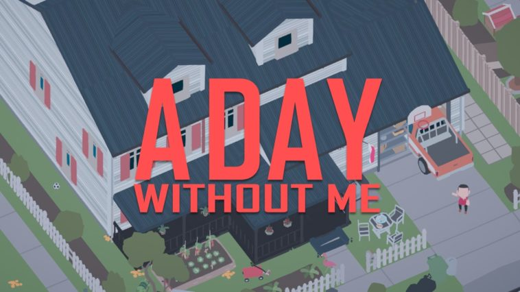
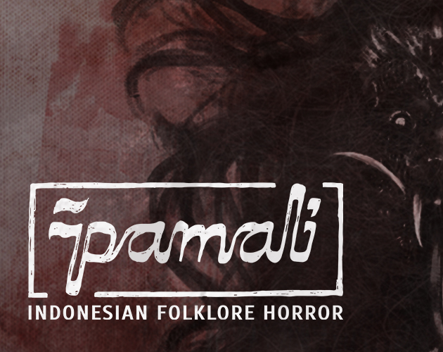
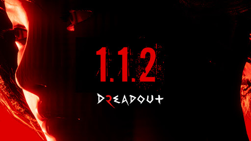
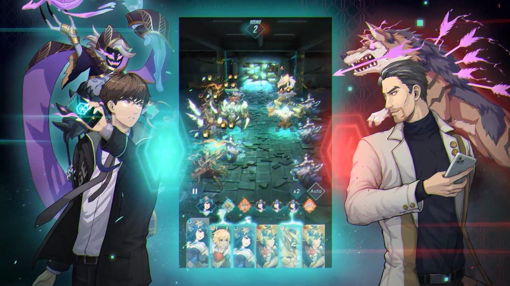
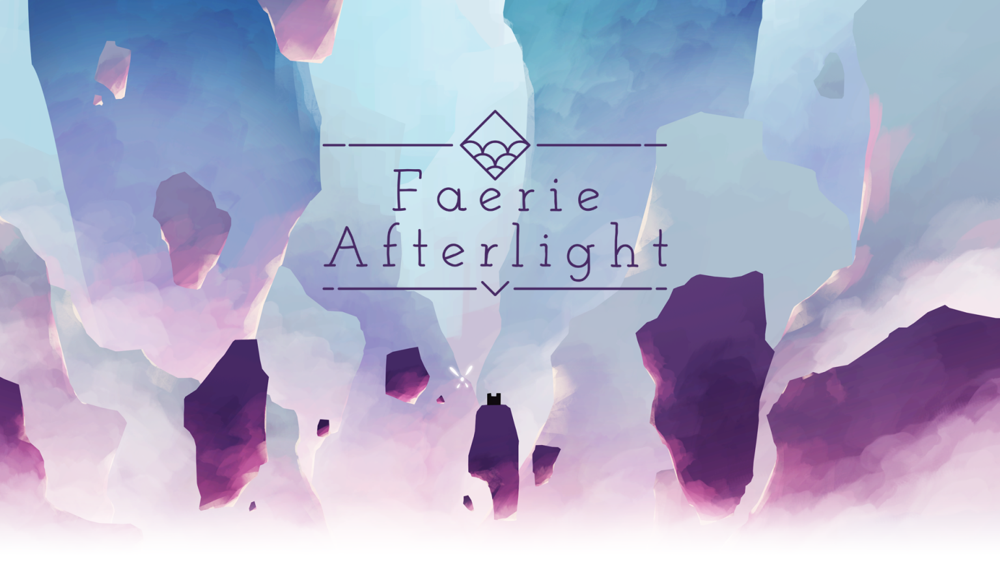
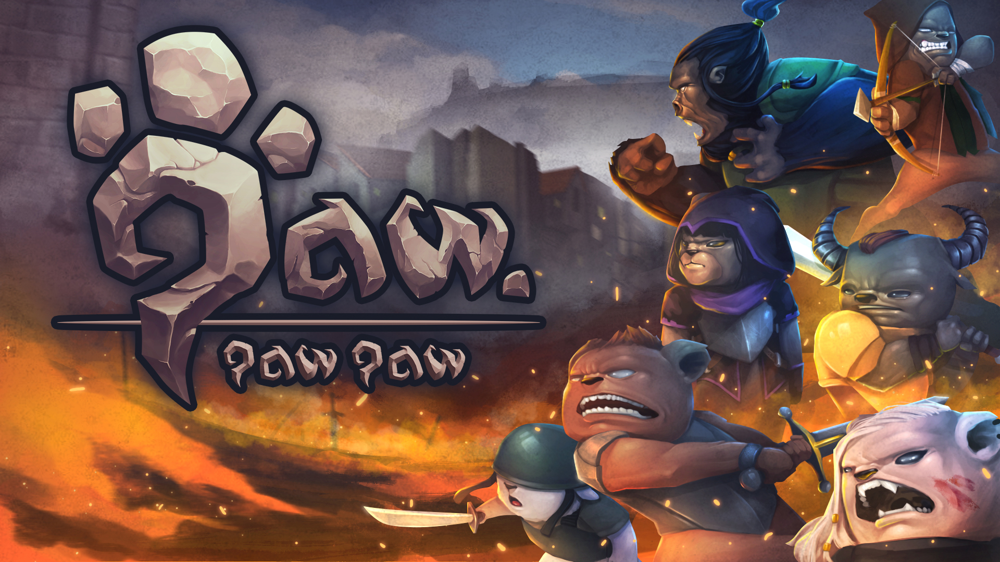

# Introduction

Selamat datang di miniclass game! Karena ini adalah miniclass game, tentunya yang pertama kali kita bahas adalah

## What is game?

Apa sih game itu? Game adalah aktivitas yang menghibur atau menyenangkan untuk dilakukan. Beberapa elemen yang harus dimiliki game, yaitu :

- Rules
    
    Peraturan yang ada di game. Misalnya saja pada catur, pawn hanya bisa maju 1 kali, untuk langkah pertama bisa 1 kotak, bisa 2 kotak. Kuda bisa bergerak dengan pattern L, dan Benteng bisa bergerak secara horizontal dan vertikal saja.
- Conflict

    Conflict yang dimaksud ini adalah persaingan antar pemain ataupun antar tim. Akan ada pemain atau tim yang akan menjadi pemenang, dan yang lainnya akan kalah dalam permainan.
- Goals

    Tujuan yang harus dicapai oleh pemain atau tim. Misalnya pada permainan catur, kita diharuskan membunuh atau menutup pergerakan raja dari musuh.
- System

- Melibatkan decision making

- Form of Art

Kebanyakan dari kalian pasti sering bermain game, mulai dari game mobile, dekstop, maupun board game. Dan mungkin juga, kalian tidak asing dengan gambar gambar ini. 

[Fornite(epicgames.com)](https://www.epicgames.com/fortnite/en-US/home)

Game ini adalah salah satu contoh dari game yang telah digarap oleh studio besar nih. Keren ya! 

Namun, tidak kalah dengan studio-studio besar, ada juga karya dari studio-studio indie yang bisa dibilang cukup sukses. Misalnya saja :

[Minecraft(minecraft.net)](https://www.minecraft.net/en-us)

[Stardew Valley (stadewvalley.net)](https://www.stardewvalley.net/)

Nah, di Indonesia juga tidak kalah dong. Beberapa hasil karya anak bangsa yang terkenal adalah :

[A Day Without Me by Gamecom](https://gamebrott.com/a-day-without-me-kini-telah-resmi-hadir-di-steam)

[Pamali by Story Tale Studio](https://storytaledev.itch.io/pamali)

[Dread Out by Digital Happiness](http://www.digitalhappiness.net/)

[Code Atma by Agate](https://gizmologi.id/games/agate-code-atma/)

Mengerucut ke lingkup yang lebih kecil lagi nih, di kota Malang ini juga terdapat banyak studio game! Contohnya saja :

[Faerie Afterlight by Clay Game Studio](https://claygamestudio.itch.io/faerie-afterlight)

[Startup Panic by Algo Rocks](https://www.epicgames.com/store/en-US/product/startup-panic/home)

[Paw Paw Paw by Simpleton](https://simpleton.itch.io/pawpawpaw)

Di balik game-game keren di atas, ada orang orang dengan role yang berbeda-beda dan bekerja sama. Role tersebut adalah :
- Programmer
- Artist
- Game Designer
- Producer
- Sound engineer

Role ini berbeda-beda untuk tiap studio, tergantung pada beberapa aspek. Namun yang biasanya selalu ada di team gamedev adalah artist yang bertanggung jawab untuk visual dan programmer yang bertanggung jawab untuk menyatukan dan mengeksekusi game dari hasil karya artist.